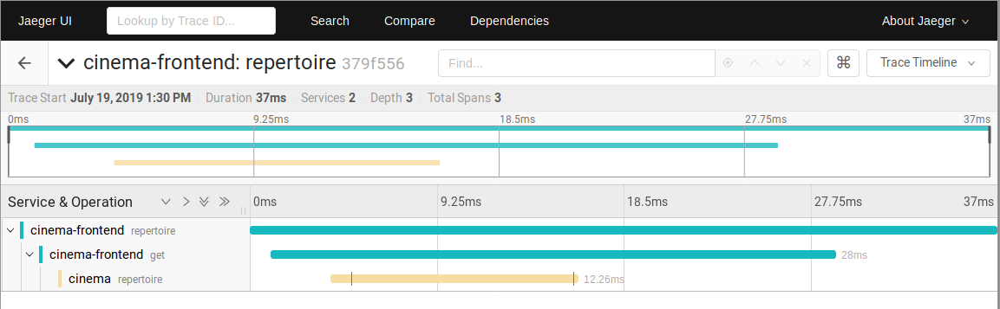

# React Client Distributed Tracing with Zipkin

This tutorial illustrates the usage of distributed tracing in a typical client-server web application. We use Zipkin-JS for instrumentation in a React client app, Spring Boot service instrumented using OpenTracing in a backend service, and Jaeger tracer for collecting traces.

The sample web application is running a cinema theater scenario:
* *frontpage* (client) for listing available films in a cinema theater.
* *cinema* (backend service) provides its repertoire (`/repertoire`).
* *distributor* (remote service) service provides available movies (`/movies`) from an in-memory h2 db.

A user opens _client_ which queries _backend service_ for repertoire which in turn gets it from _distributor_.

## Running example

1. Run *cinema* and *distributor* services alongside with Jaeger tracer using our Spring Boot [OpenTracing tutorial](https://github.com/tracing-dk/tutorials/tree/master/spring-boot-opentracing).
2. Run client app `npm start`.
3. Inspect the results in [Jaeger UI](http://localhost:16686).

You should be able to see a trace spanning from frontend to backend:
