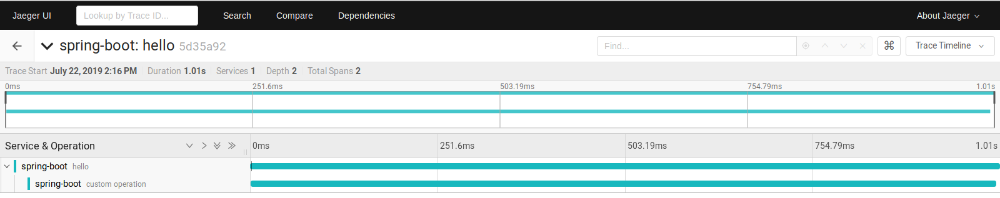
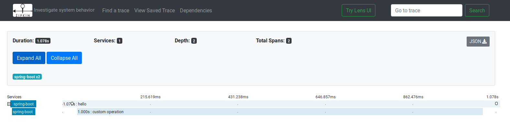

# Vendor independent Spring Boot OpenTracing instrumentation

This tutorial illustrates the usage of OpenTracing in a Spring Boot application without a lock for a specific Tracer implementation. We use a sample Spring Boot application created with [Spring Initialzr](https://start.spring.io/).

## OpenTracing instrumentation

The sample app uses several OpenTracing features:
* `opentracing-spring-web-starter` (see [pom.xml](pom.xml) for details) provides auto-configuration for incoming and outgoing requests.
* Hello service (`/hello`) in `HelloController` extracts the active span ('request') and adds additional custom tracing information -- a subspan `custom operation`.

Notice that there are no dependencies to any Tracer implementation, only OpenTracing ones, meaning all the instrumentation so far is done purely using:

```java
import io.opentracing.Scope;
import io.opentracing.Span;
import io.opentracing.log.Fields;
import io.opentracing.tag.Tags;
import io.opentracing.util.GlobalTracer;
```

Since we haven't specified a tracing system where the spans must be reported, the auto-configuration will choose `NoopTracer`. Because we are using OpenTracing instrumentation, we are not bound to any specific tracing system. We will now show how to first use Jaeger and then switch to Zipkin. We will see that changing the tracing system is just a matter of configuration and does not require any changes in the instrumented code.

## Jaeger

This example uses a runtime configuration meaning we don't even need to have a compile time dependency of Jaeger in order to use this tracing system.

In [pom.xml](pom.xml) let's add following _runtime_ dependency:

```xml
<dependency>
  <groupId>io.jaegertracing</groupId>
  <artifactId>jaeger-client</artifactId>
  <version>${jaeger.version}</version>
  <scope>runtime</scope>
</dependency>
```

There are [several methods](https://github.com/jaegertracing/jaeger-client-java/tree/master/jaeger-core) to configure Jaeger tracer. The least intrusive is via [environment](https://github.com/jaegertracing/jaeger-client-java/tree/master/jaeger-core#configuration-via-environment). The single required parameter is `JAEGER_SERVICE_NAME`:

```bash
export JAEGER_SERVICE_NAME=spring-boot-vendor-independent
```

And that's it. Ensure you have a Jaeger instance running:

```bash
docker run -d --name jaeger \
  -e COLLECTOR_ZIPKIN_HTTP_PORT=9411 \
  -p 5775:5775/udp \
  -p 6831:6831/udp \
  -p 6832:6832/udp \
  -p 5778:5778 \
  -p 16686:16686 \
  -p 14268:14268 \
  -p 9411:9411 \
  jaegertracing/all-in-one:1.13
```

Then run the sample Spring Boot app. You should notice how Jaeger runtime instantiates a tracer:

```
2019-07-22 14:51:49.011  INFO 28829 --- [           main] io.jaegertracing.Configuration           : Initialized tracer=JaegerTracer(version=Java-0.35.5, serviceName=spring-boot-vendor-independent, reporter=RemoteReporter(sender=UdpSender(), closeEnqueueTimeout=1000), sampler=RemoteControlledSampler(maxOperations=2000, manager=HttpSamplingManager(hostPort=localhost:5778), sampler=ProbabilisticSampler(tags={sampler.type=probabilistic, sampler.param=0.001})), tags={hostname=machine, jaeger.version=Java-0.35.5, ip=127.0.1.1}, zipkinSharedRpcSpan=false, expandExceptionLogs=false, useTraceId128Bit=false)
2019-07-22 14:51:49.016  WARN 28829 --- [           main] i.o.c.s.t.c.TracerAutoConfiguration      : Tracer bean is not configured! Switching to JaegerTracer(version=Java-0.35.5, serviceName=spring-boot-vendor-independent, reporter=RemoteReporter(sender=UdpSender(), closeEnqueueTimeout=1000), sampler=RemoteControlledSampler(maxOperations=2000, manager=HttpSamplingManager(hostPort=localhost:5778), sampler=ProbabilisticSampler(tags={sampler.type=probabilistic, sampler.param=0.001})), tags={hostname=machine, jaeger.version=Java-0.35.5, ip=127.0.1.1}, zipkinSharedRpcSpan=false, expandExceptionLogs=false, useTraceId128Bit=false)
```

Now once you query `/hello` service, you'll see the resulting trace with two spans (one from auto-config incoming request and the other the `custom operation`) in [Jaeger UI](http://localhost:16686):



## Zipkin

Suppose we've decided to use Zipkin instead of Jaeger. The only thing we need to change is the actual global `Tracer` which was provided by `jaeger-client` bean in previous example. Let's replace it in our configuration with a Zipkin tracer:

```java
@Bean
public io.opentracing.Tracer zipkinTracer() {
  OkHttpSender okHttpSender = OkHttpSender.newBuilder()
      .encoding(Encoding.JSON)
      .endpoint("http://localhost:9411/api/v2/spans")
      .build();
  AsyncReporter<Span> reporter = AsyncReporter.builder(okHttpSender).build();
  Tracing braveTracer = Tracing.newBuilder()
      .localServiceName("spring-boot")
      .spanReporter(reporter)
      .traceId128Bit(true)
      .sampler(Sampler.ALWAYS_SAMPLE)
      .build();
  return BraveTracer.create(braveTracer);
}
```

Try running Zipkin (`docker run -d -p 9411:9411 openzipkin/zipkin`) and then query the `/hello` service again. In [Zipkin UI](http://localhost:9411) you will see exactly same detailed information as in Jaeger case:




## Summary

We have demonstrated the vendor-lock-free instrumentation of a Spring Boot application with OpenTracing. It's important to note that this demo focused on achieving O(1) for changing the tracing system. As a side-effect, we have also demonstrated a path for wiring different instrumentations together.
